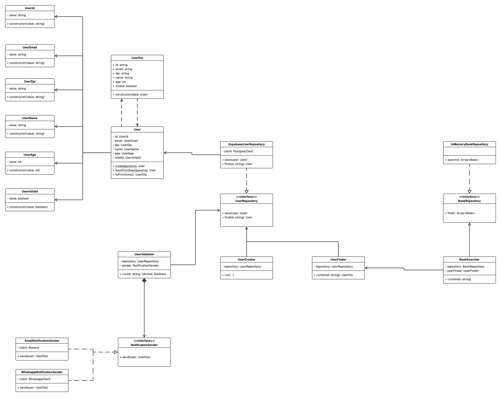
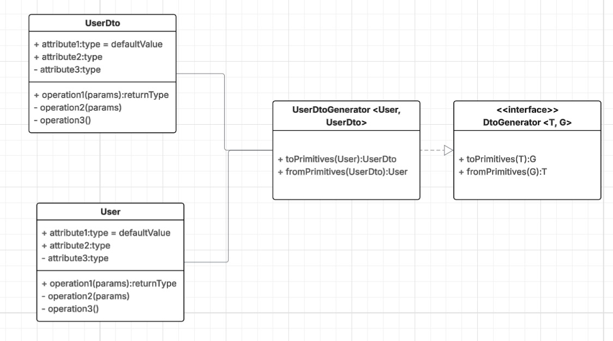

Project Distribution:
src/
├── domain/
│   ├── models/
│   │   ├── user/
│   │   │   ├── value-objects/
│   │   │   │   ├── UserId.ts
│   │   │   │   ├── UserEmail.ts
│   │   │   │   ├── UserDpi.ts
│   │   │   │   ├── UserName.ts
│   │   │   │   ├── UserAge.ts
│   │   │   │   └── UserIsValid.ts
│   │   │   ├── interfaces/
│   │   │   │   └── DtoGenerator.ts
│   │   │   ├── UserDtoGenerator.ts
│   │   │   ├── User.ts
│   │   │   └── UserDto.ts
│   │   ├── book/
│   │   │   ├── interfaces/
│   │   │   │   └── BookRepository.ts
│   │   │   └── BookSearcher.ts
│   │   └── notification/
│   │       ├── interfaces/
│   │       │   └── NotificationSender.ts
│   │       ├── EmailNotificationSender.ts
│   │       └── WhatsAppNotificationSender.ts
│   ├── repositories/
│   │   ├── interfaces/
│   │   │   └── UserRepository.ts
│   │   ├── SupabaseUserRepository.ts
│   │   └── InMemoryRepository.ts
│   └── services/
│       ├── UserValidator.ts
│       ├── UserFinder.ts
│       └── BookSearcher.ts
├── application/
│   └── use-cases/
│       ├── user/
│       │   ├── CreateUser.ts
│       │   ├── FindUser.ts
│       │   └── ValidateUser.ts
│       └── book/
│           └── SearchBooks.ts
└── infrastructure/
    └── config/
        └── dependencies.ts

Propuesta Diagrama:

Propuesta Solucion a Dependencia Circular:
